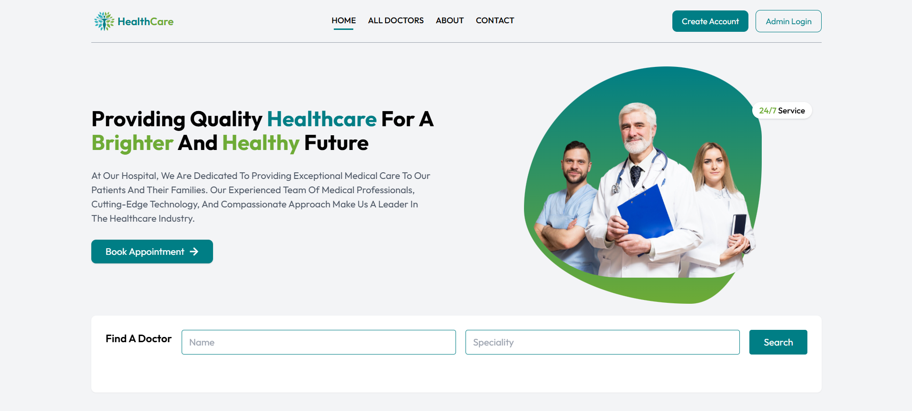

# 🩺 Health Care Website

A full-featured healthcare web application where users can explore doctors, book appointments, make payments, and much more. Built with the **MERN Stack** and styled using **Tailwind CSS**, this project features role-based dashboards for Customers, Doctors, and Admins with a smooth, modern UI.

---

## 🌐 Live Demo

🔗 [Live Website](https://healthcare-website-y0yg.onrender.com)  

---

## 🚀 Features

- ✅ Dynamic Menu Based on Role  
- ✅ Separate Login for Customer, Doctor & Admin (Role based authentication)
- ✅ Browse Doctors with Filterable Specialities  
- ✅ Book & Cancel Appointments  
- ✅ Online Payment Integration  
- ✅ Doctor Availability Status  
- ✅ Update Profile Functionality  
- ✅ Smooth, Responsive UI with Tailwind CSS  
- ✅ Scroll Animations (AOS)  
- ✅ Error Page & Loading Effects  
- ✅ Fully Separated Frontend and Backend Architecture  
- ✅ Secure APIs with Token Authentication  
- ✅ Modular & Clean Code  
- ✅ Separate Login for Doctors (not admin)  
- ✅ And many more...

---

## 🛠 Tech Stack

**Frontend:** React.js, Tailwind CSS, AOS, React Router  
**Backend:** Node.js, Express.js, MongoDB, JWT  
**Authentication:** Role-based Authentication (JWT)  
**Payment Gateway:** Razorpay  
**Image Storage:** Cloudinary  
**Deployment:** Render

---

## 📸 Preview



---

## 📂 Folder Structure

```bash
📁 project-root/
├── 📁 frontend/
│   ├── 📁 assets/
│   ├── 📁 components/
│   ├── 📁 pages/
│   ├── 📁 context/
│   └── 📄 ... (other frontend files like App.js, index.js, etc.)
│
├── 📁 backend/
│   ├── 📁 controllers/
│   ├── 📁 models/
│   ├── 📁 routes/
│   ├── 📁 middlewares/
│   ├── 📁 config/
│   └── 📄 ... (server.js, .env, etc.)
│
├── 📁 admin/
│   ├── 📁 assets/
│   ├── 📁 components/
│   ├── 📁 pages/
│   ├── 📁 context/
│   └── 📄 ... (other files like App.js, index.js, etc.)
│
└── 📄 README.md
```

---

## 🙋‍♂️ Author
- Atishay Jain
- atishayjain8807@gmail.com

---

## 🤝 Contributing

Contributions are welcome! Feel free to open issues or submit pull requests for any improvements or bug fixes.
